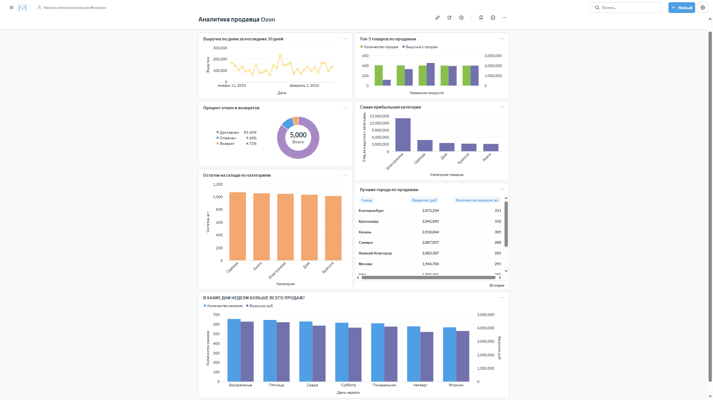

# 📊 Анализ продавца Ozon

## 🎯 О проекте
Дашборд для анализа ключевых метрик продавца на маркетплейсе Ozon.

## 🛠 Технологии
- **PostgreSQL** — база данных
- **Metabase** — дашборд
- **SQL** — анализ данных
- **Cursor AI** — разработка 

## 📈 Результаты

## 📁 Структура проекта
- `SQL` — папка с SQL запросами для анализа
- `generate_data.py` — Python-скрипт для генерации тестовых данных
- `create_tables.sql` — SQL запрос для создания таблиц из сгенерированных данных
- `create_tables_simple.sql` — упрощенный SQL запрос для создания таблиц из сгенерированных данных
- `products.csv` — сгенерированные данные о товарах (200 строк)
- `sales.csv` — сгенерированные данные о продажах (5000 строк)
- `Отчет` — папка со скриншотами
- `Ozon_Analytycs_report.pdf` — отчет по проекту
